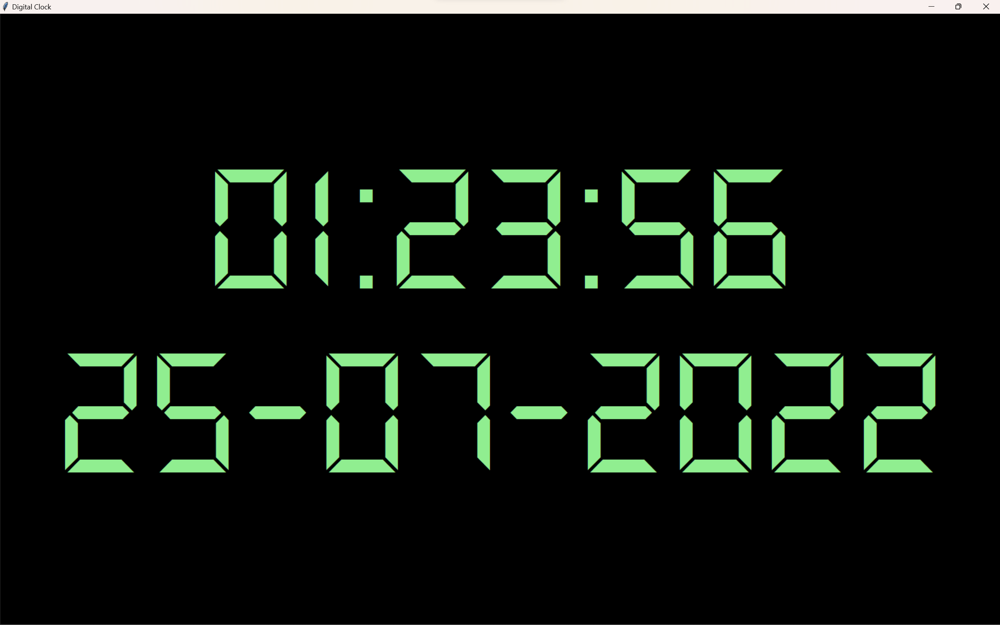
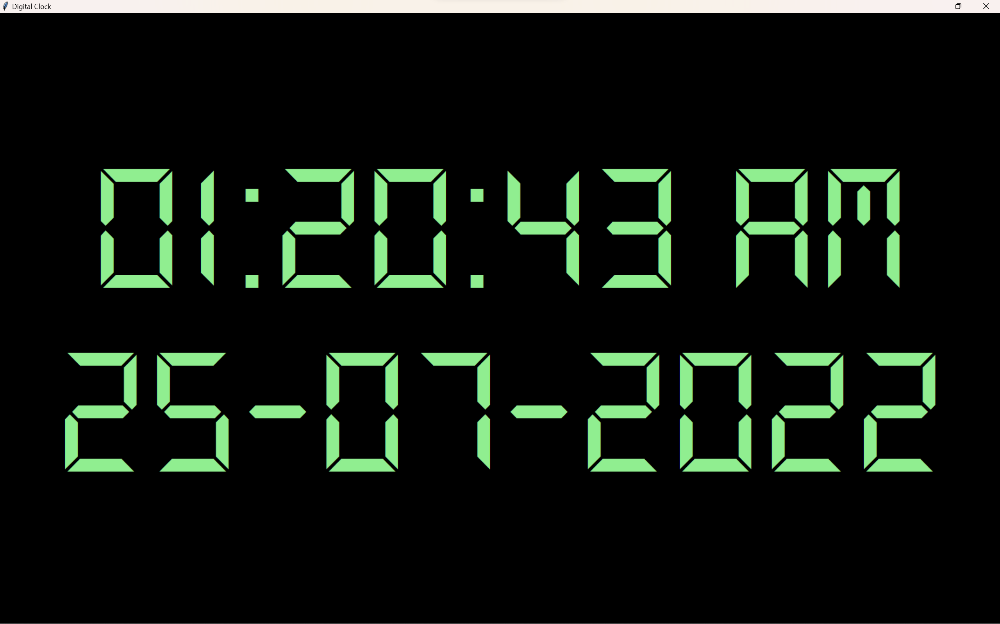

# Fullscreen-digital-clock

#### Feel free to fork into your Github and modify it with your own design!
#### You may modify this from the constant variable:

1. `FONT_SIZE = 240`  (set the font size)
1. `FONT_STYLE = "ds-digital"`  (set the font style)
1. `TEXT_COLOR = "lightgreen"`  (set the text color)
1. `BACKGROUND_COLOR = "black"`  (set the background color)
1. `TIME_FORMAT = "%I:%M:%S %p"`  (this is 12 hour time format)
1. `TIME_FORMAT = "%H:%M:%S"`  (this is 24 hour time format)

##### This is the sample output.

### 12 hour format

### 24 hour format

